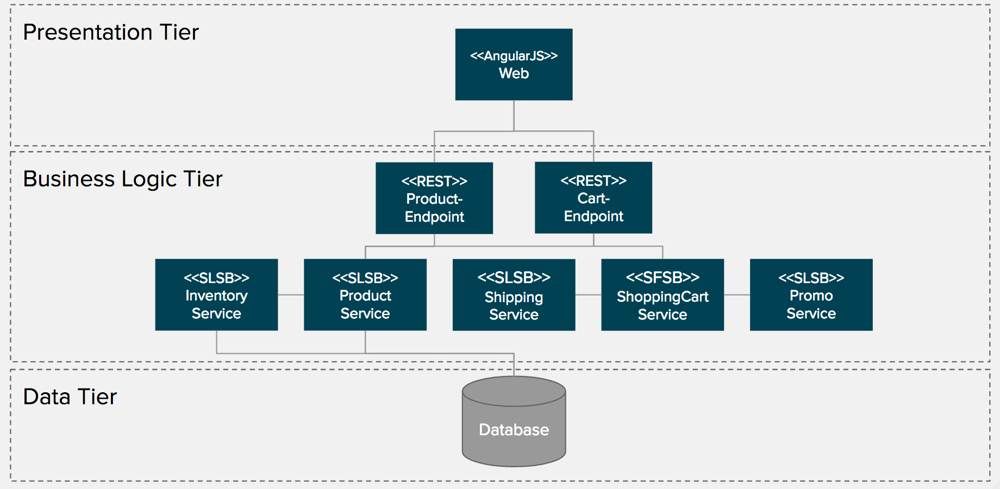
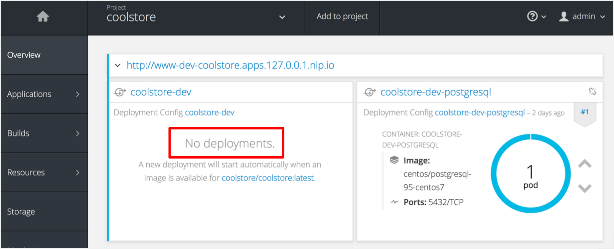

== Exercise 1 - Title
Thomas Qvarnstrom <tqvarnst@redhat.com>; James Falkner <jfalkner@redhat.com>
:revnumber: 1.0

=== What you will learn

Participants will learn how to:

1. Deploy a monolith/legacy application to OpenShift using different deployment methods (binary,s2i maven, tagging images)
2. How OpenShift supports legacy application and managing state.
3. How to use a deployment pipeline to automate deployments. 

=== Background information

The application that we are going to use in this lab is a retail application called Coolstore. The coolstore is a Java EE application using both Stateless and Stateful EJBs. The architecture of the application looks like this:+
[[img-monolith-architecture]]

=== Setup the development environment

In this exercise we will build and deploy a the coolstore application using binary deployment.

Step 1 - Open a terminal window
+
Click on Winkey on you keyboard and click on the terminal logo in the Favorites to the left
+
image::images/ex1-open-terminal.png

Step 2 - Verify that you are authenticated to 

Step 1 - Create coolstore project::
+
To create the OpenShift project we will use the `oc` command line tool, however this step could also be done using the web console that we will see later.
+
[source,bash]
----
cd projects/monolith
oc new-project coolstore
----

Step 2 - Apply the application template::
+
In order to deploy the application to OpenShift we need a number of different component. In OpenShift we can collect a number of such components in a template so that by applying the template all these components will be created in a single command/click.
+
Note: Templates is a great way for devloper organisations to be able to get matching environment in OpenShift.
+
Tip: Templates can be parameterized to allow for customization.
+
[source,bash]
----
oc process -f src/main/openshift/template.json | oc create -f -
----
+
If you open your web console and navigate to the coolstore project you should after a while see a screen that looks like the picture below.
+

Ste 3 - 

=== Summary

In this exercise you have learned how to ...

=== Links

For more information, please have a look at the following articles and documents:

* http://somelink.org[Example link]
